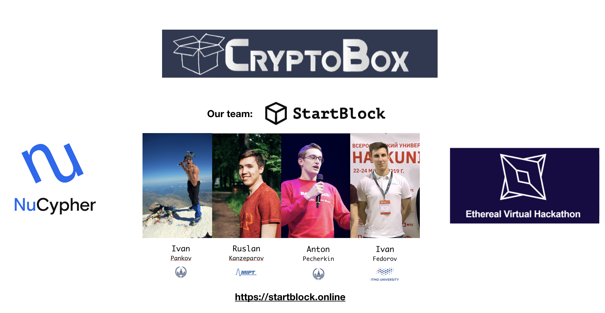
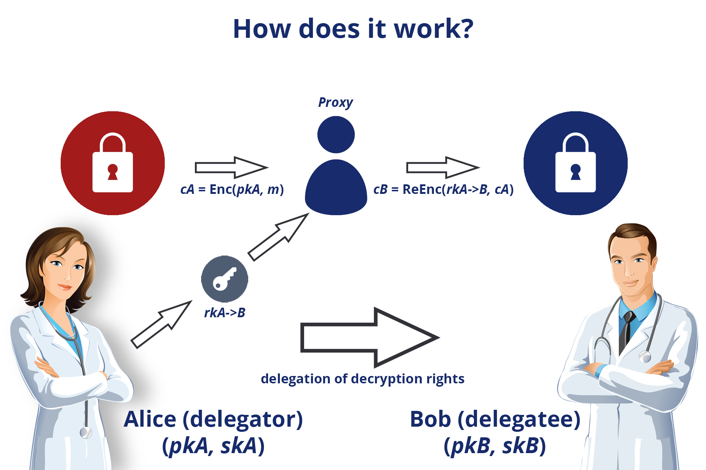
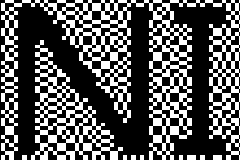
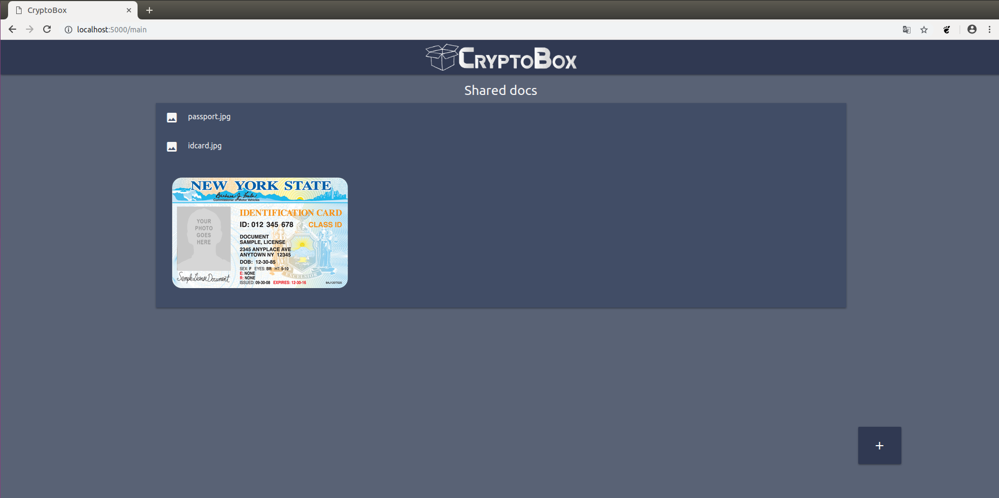
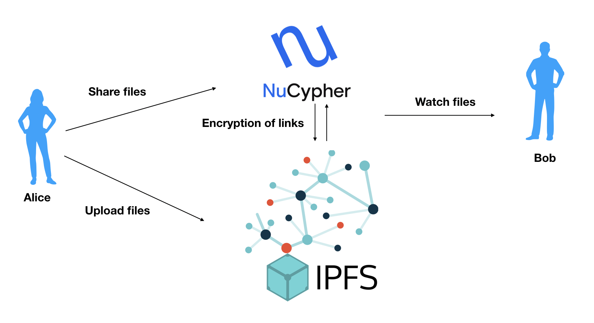

# MongoBox
MongoBox allows you to store copies of documents in one protected place with the ability to safely share them with the right person.

## Structure

<ol type="1" style="font-size: x-large;">
<li> <a href="#about">About</a> 
<li> <a href="#problems-and-solution">Problems and solution</a> 
<li> <a href="#technical-solution">Technical solution</a> 
<ol type="a" style="font-size: large;">
  <li> <a href="#user-application">User application</a> 
  <li> <a href="#nucypher-encryption">NuCypher encryption</a> 
  <li> <a href="#ipfs">IPFS</a> 
  <li> <a href="#a-hidden-pixel">A hidden pixel</a> 
</ol>
<li> <a href="#installation">Installation</a> 
<ol type="a" style="font-size: large;">
  <li> <a href="#web-application">Web application</a> 
  <li> <a href="#android-application">Mobile application</a> 
</ol>
<li> <a href="#finally">Finally</a> 
<li> <a href="#team">Team</a> 
</ol>

## About

We are team **StartBlock** and we have indroduce our product, that we have implemented during the hackathon - **MongoBox**.

We introduce the **MongoBox** product - storing copies of documents in one protected place, with the ability to share them with the right person in a safe way using Mongo Data Base and NuCypher technology .

<a href="https://youtu.be/0fELI3UzedY">Video-presentation of the MongoBox</a>

## Problems and solution

Today there are the following problems:
- All the necessary documents are not at hand in the right situation, so we spend time in document search situations
- We need to store information about all documents from fraudsters very securely and check documents for originality.
- Many organizations ask for identity documents only for a while, after which access to the document should be closed
- Leaking documents into the network can be a disaster for everyone.

Our product allows you to:
- Keep copies of documents in one place and always at hand for the user
- Be sure that the information is reliably protected and accessible only to the right people for a certain time. To do this, use NuCypher encryption, data storage in IPFS and the use of a hidden pixel for marking your own documents and protecting against copying on the network.
- Share documents with the right people for a certain time using NuCypher technology

# Technical solution

Our solution is a product implemented as a web application, as well as a mobile application for Android, so that it can be used at any convenient time.

<a href="https://youtu.be/0fELI3UzedY">Video-presentation of the Cryptobox</a>

The application is fully functional and you can try it in action right now at the link: 

We’ve created the infrastructure:

* <a href="https://github.com/kanzeparov/NuCypher/tree/master/nucypher/nucypher/blockchain">A web application for user</a>;

* <a href="https://github.com/kanzeparov/NuCypher/tree/master/NewCApplication_Android">Mobile application for user</a>;

* <a href="https://github.com/kanzeparov/NuCypher/tree/master/nucypher/examples/finnegans_wake_demo">NuCypher encryption and generation re-encryption keys for third-party applications</a>;

* <a href="https://github.com/kanzeparov/NuCypher/tree/master/nucypher">IPFS is decentralized file system for save documents</a>;

* <a href="https://github.com/kanzeparov/NuCypher/tree/master/NewCApplication_Android/VCSecure">Creation a hidden pixel to mark your own documents and protect against online copying</a>;

In our application, we tried to take into account everything for the safe storage of documents and convenient use for file sharing between people. The application is a complete solution to the problem, plus the use of IPFS as a decentralized data repository and the creation of a secret pixel to identify files. The application is cross-platform.
This application is fully functional and can be used right now. We believe that this is a great result during the hackathon.

Next, we consider the main blocks of our solution and their technical implementation.

# User application

Our project is implemented in two forms: both web and mobile application.
You can use the web application simply by following the link:

Detailed installation instructions are given in the <a href="#installation">“Installation”</a> section.

Let's take a look at how the application works:

1. First, we go to your personal account.
2. In the personal account, we see all the documents available to us. Documents are stored using IPFS, thereby achieving complete decentralization.
3. We can add a new document by uploading a file. When downloading the file is placed in a decentralized repository - IPFS. NuCypher encryption algorithm is applied to the file and it becomes accessible only to the user. The user identification algorithm is also applied to the file, a secret pixel is generated and embedded, which contains information about the user.
4. We can share any document by specifying the recipient's public key and the number of hours to access the document. Using NuCypher technology, the specified user is granted temporary access to the document.

You can watch a video demonstration of the product: 

https://youtu.be/0fELI3UzedY

# NuCypher encryption

NuCypher leverages the power of proxy re-encryption to bring private data to public blockchains. How does it work? 

1. Alice, the data owner, encrypts data with her public key and uploads it to IPFS, Swarm, S3, or any supported storage layer. To delegate access to valid recipients, she creates and uploads re-encryption keys to the NuCypher network.
2. Ursula, a miner, receives the re-encryption keys and stands ready to re-key data. She provides this service in exchange for payment in fees and block rewards. The NuCypher network and the storage layer never have access to Alice's plaintext data.
3. Bob, a valid recipient, sends an access request to the NuCypher network. If a valid re-encryption key exists and specified conditions are met, the data is re-keyed to his public key and he is able to decrypt with his private key.

# IPFS

IPFS is a distributed system for storing and accessing files, websites, applications, and data, so, we use this technology as a data storage in our project. It’s a peer-to-peer (p2p) filesharing system that aims to fundamentally change the way information is distributed across & beyond the globe. IPFS consists of several innovations in communication protocols and distributed systems that have been combined to produce a file system like no other.

For install IPFS on local machine you need:
1. Download <a href="https://dist.ipfs.io/#go-ipfs" target="_blank">IPFS for your platform</a>
2. tar xvfz go-ipfs.tar.gz
3. cd go-ipfs
4. ./install.sh

For run:
1. ipfs init
2. ipfs daemon

# A hidden pixel

Problem: when opening access to a particular file, there is often a problem with the leakage of information into the network. For example, we provide access to a passport, a fraudulent organization, and it can put these documents on some other resource. To combat this problem, we can use visual encryption, encrypting in the image information about to whom we provide this information, in case of leakage, we can easily determine who the data were laid out.

VCWithoutPixelExpansion, VCSecure - folders for encrypting and decrypting an image.

Visual Cryptography is a technique that allows information (images, text, diagrams …) to be encrypted using an encoding system that can be decrypted by the eyes. It does not require a computer to decode.
The technique is attributed to two great mathematicians: Moni Naor and Adi Shamir, in 1994. In this implementation, I will show how to split a secret message into two components. Both parts are necessary to reconstruct and reveal the secret, and the possession of either one, alone, is useless in determining the secret.

The basis of the technique is the superposition (overlaying) of two semi-transparent layers. Imagine two sheets of transparency covered with a seemingly random collection of black pixels.
Individually, there is no discernable message printed on either one of the sheets. Overlapping them creates addition interference to the light passing through (mathematically the equivalent of performing a Boolean OR operation with the images), but still it just looks like a random collection of pixels.
Mysteriously, however, if the two grids are overlaid correctly, at just the right position, a message magically appears! The patterns are designed to reveal a message

# Installation
Requirements:
1. Python >=3.6
2. Flask
3. Ipfs 

For local installation you need to run following commands (from nucypher directory): 
1. pipenv install --dev --three --skip-lock --pre
2. pipenv install flask
3. pipenv install ipfsapi
4. pipenv run python3.7 run examples/finnegans-wake-demo/finnegans-wake-concise-demo.py

For the application to work correctly, the ipfs daemon must be running (cmd ipfs daemon). 

# Web application

Web-version of project is available by link: http://livedemo.su:3000

You can authorize without password only by login. We implemented to cases:

1. Alice authorization 
2. Bob and another names authorization

With Alice authorization you can upload files and share them for another users. With Bob authorization you can only read files, which were shared by Alice.
 
Example of Bob authorization: 

# Mobile application

Requirements: '
1. Android 2.0
2. JDK Java 10.0

Download Android Studio, JDK and Project and click on  to run the project.
Launch Android application - button “cypher info” sending information to the server, uploading files to ipfs. Work is similar to work with web
 

“Take picture with sign” button - encrypts images to check for whom the file was provided. According to this algorithm, the picture is encrypted using the method of visual cryptography (pixels are superimposed on each other). Each time, encryption takes a unique form - so that in the future it can be easily determined who posted the information about this picture (which of the companies that were granted access)

More information: [A hidden pixel](#a-hidden-pixel)

# Finally

**CryptoBox** is a complete product for safe storage of your documents in one place and convenient use.

<a href="https://youtu.be/0fELI3UzedY">Video-presentation of the Cryptobox</a>

The use of IPFS technology makes it possible to decentralize the data warehouse. A secret pixel will allow you to check the originality of the document and find the document on the network, which prevents copying and distribution of documents.

The full structural scheme of the proposed solution is presented below.

During this hackathon:

- We have created a fully working user application for the safe storage and sharing of documents. The application is implemented in the both form of web and mobile versions.
- Thanks to NuCypher re-encryption has the opportunity to share any document from the list with the desired user for the required amount of time.
- For reliable document storage, the best method of decentralized file storage at the moment is used - IPFS.
- In order to protect copies of documents and distribute them online, we studied and applied the method of marking a file by stitching a hidden pixel containing information about the owner of the file. This method is already used to protect against copying documents.

We implemented all this within the framework of the Hackathon with the active interaction of the whole team!

# Team

