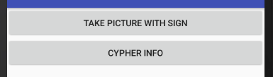
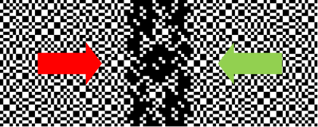
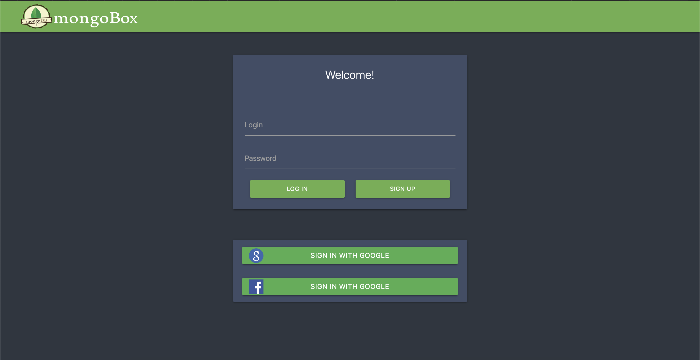

# MongoBox
MongoBox allows you to store copies of documents in one protected place with the ability to safely share them with the right person.

## Structure

<ol type="1" style="font-size: x-large;">
<li> <a href="#about">About</a> 
<li> <a href="#problems-and-solution">Problems and solution</a> 
<li> <a href="#technical-solution">Technical solution</a> 
<ol type="a" style="font-size: large;">
  <li> <a href="#user-application">User application</a> 
  <li> <a href="#nucypher-encryption">NuCypher encryption</a> 
  <li> <a href="#mongo-database">Mongo DataBase</a> 
  <li> <a href="#a-hidden-pixel">A hidden pixel</a> 
</ol>
<li> <a href="#installation">Installation</a> 
<ol type="a" style="font-size: large;">
  <li> <a href="#web-application">Web application</a> 
  <li> <a href="#android-application">Mobile application</a> 
</ol>
<li> <a href="#finally">Finally</a> 
<li> <a href="#team">Team</a> 
</ol>

## About

We are team **StartBlock** and we have indroduce our product, that we have implemented during the hackathon - **MongoBox**.

We introduce the **MongoBox** product - storing copies of documents in one protected place, with the ability to share them with the right person in a safe way using Mongo Data Base and NuCypher technology .

<a href="https://youtu.be/7cIWS-rW-fU">Video-presentation of the MongoBox</a>

<a href="http://livedemo.su:3000">Web-application of the MongoBox</a>

## Problems and solution

Today there are the following problems:
- All the necessary documents are not at hand in the right situation, so we spend time in document search situations
- We need to store information about all documents from fraudsters very securely and check documents for originality.
- Many organizations ask for identity documents only for a while, after which access to the document should be closed
- Leaking documents into the network can be a disaster for everyone.

Our product allows you to:
- Keep copies of documents in one protected place and always at hand for the user
- Storing an encrypted file in a Mongo Atlas database
- Connect and display data in a web interface and mobile application for convenient use using Mongo Stitch and Mongo Mobile
- Be sure that the information is reliably protected and accessible only to the right people for a certain time. To do this, use NuCypher encryption, data storage in Mongo DB Atlas and the use of a hidden pixel for marking your own documents and protecting against copying on the network.
- Share documents with the right people for a certain time using NuCypher technology

# Technical solution

Our solution is a product implemented as a web application, as well as a mobile application for Android using Mongo Mobile, so that it can be used at any convenient time.

<a href="https://youtu.be/7cIWS-rW-fU">Video-presentation of the MongoBox</a>

The application is fully functional and you can try it in action right now at the link: 

We’ve created the infrastructure:

* <a href="https://github.com/AntonPecherkin/MongoBox/tree/master/Web/mongo">A web application for user</a>;

* <a href="https://github.com/AntonPecherkin/MongoBox/tree/master/MongoDb_android">Mobile application for user and Mongo Mobile</a>;

* <a href="https://github.com/AntonPecherkin/MongoBox/tree/master/Web/mongo">NuCypher encryption and generation re-encryption keys for third-party applications</a>;

* <a href="https://github.com/AntonPecherkin/MongoBox/tree/master/Web/mongo">Storing an encrypted file in a Mongo Atlas database</a>;

* <a href="https://github.com/AntonPecherkin/MongoBox/tree/master/VCWithoutPixelExpansion">Creation a hidden pixel to mark your own documents and protect against online copying</a>;

In our application, we tried to take into account everything for the safe storage of documents and convenient use for file sharing between people. The application is a complete solution to the problem, plus the use of an encrypted file in a Mongo Atlas database and the creation of a secret pixel to identify files. The application is cross-platform.
This application is fully functional and can be used right now. We believe that this is a great result during the hackathon.

Next, we consider the main blocks of our solution and their technical implementation.

# User application

Our project is implemented in two forms: both web and mobile application.
You can use the web application simply by following the link:

Detailed installation instructions are given in the <a href="#installation">“Installation”</a> section.

The structure of our system is described below.

Let's take a look at how the application works:

1. First, we go to your personal account.
2. In the personal account, we see all the documents available to us. Documents are stored using an encrypted file in a Mongo Atlas database. Documents are uploaded and displayed in a web application and a mobile application using components Mongo Stitch and Mongo Mobile.
3. We can add a new document by uploading a file. When downloading the file is placed in the Mongo DB Atlas. NuCypher encryption algorithm is applied to the file and it becomes accessible only to the user. The user identification algorithm is also applied to the file, a secret pixel is generated and embedded, which contains information about the user.
4. We can share any document by specifying the recipient's public key and the number of hours to access the document. Using NuCypher technology, the specified user is granted temporary access to the document.

You can watch a video demonstration of the product: 

https://youtu.be/7cIWS-rW-fU

# NuCypher encryption

NuCypher leverages the power of proxy re-encryption to bring private data to public blockchains. How does it work? 

1. Alice, the data owner, encrypts data with her public key and uploads it to IPFS, Swarm, S3, or any supported storage layer. To delegate access to valid recipients, she creates and uploads re-encryption keys to the NuCypher network.
2. Ursula, a miner, receives the re-encryption keys and stands ready to re-key data. She provides this service in exchange for payment in fees and block rewards. The NuCypher network and the storage layer never have access to Alice's plaintext data.
3. Bob, a valid recipient, sends an access request to the NuCypher network. If a valid re-encryption key exists and specified conditions are met, the data is re-keyed to his public key and he is able to decrypt with his private key.

# Mongo DataBase

In our product we use 3 components of the software product Mongo DB: MongoDB Atlas, MongoDB Stitch, MongoDB Mobile. We use the standard mix and interaction of these products proposed by Mongo and shown in the figure below.

Next, we look at how each of the three components is used in our application and describe in more detail.

# MongoDB Atlas

MongoDB Atlas - modern reliable database for storing files and convenient access to them from any device.

Out-of-the-box protection of your most valuable data assets. Security features include TLS/SSL encryption, authentication, and authorization via SCRAM; network isolation and VPC Peering on AWS; IP whitelists; encrypted storage volumes; and the MongoDB Atlas console to manage database users.

One-click, automated sharding for scale out, and zero-downtime scale up to larger instance types. You can provision TBs of database storage, all on high performance SSDs with dedicated I/O bandwidth.

A minimum of three data nodes per replica set are automatically deployed across availability zones (AWS), fault domains (Azure), or zones (GCP) for continuous application uptime in the event of outages and routine maintenance.

# MongoDB Stitch

The serverless platform from MongoDB. Allows you to create infrastructure around the database and connect different devices into a single unit.

Exposes the full power of working with documents in MongoDB and the MongoDB query language, directly from your web and mobile application frontend code. A powerful rules engine lets developers declare fine-grained security policies.

Automatically synchronizes data between documents held locally in MongoDB Mobile and the backend database.

# MongoDB Mobile

MongoDB Mobile brings the power of MongoDB and the document model to your device.

It complements the database architecture and allows you to quickly update information in the database from a mobile phone and load it.

Requirements: '
1. Android 2.0
2. JDK Java 10.0

Download Android Studio, JDK and Project and click on  to run the project.
Launch Android application - button “cypher info” sending information to the server, uploading files to ipfs. Work is similar to work with web
 

During the creation of the application, we used the following mongodb services: mongodb stitch, mongodb mobile.  Our application connects to the database, which is located on the stitch, unloads from there a string in base64 format.  On Android, it caches this line in order to quickly display this image in the future.  And translates from base64 format to image.  In the same way, the image is loaded into the database of the stitch.  When you click the save button, our document is saved locally on the device.  Also, a hidden pixel is attached to this picture, so that in case of leakage there is an opportunity to track the leakage location.

More information: [A hidden pixel](#a-hidden-pixel)

# A hidden pixel

We found one more problem and concentrate on this in our product, too.

Problem: when opening access to a particular file, there is often a problem with the leakage of information into the network. For example, we provide access to a passport, a fraudulent organization, and it can put these documents on some other resource. To combat this problem, we can use visual encryption, encrypting in the image information about to whom we provide this information, in case of leakage, we can easily determine who the data were laid out.

VCWithoutPixelExpansion, VCSecure - folders for encrypting and decrypting an image.

Visual Cryptography is a technique that allows information (images, text, diagrams …) to be encrypted using an encoding system that can be decrypted by the eyes. It does not require a computer to decode.
The technique is attributed to two great mathematicians: Moni Naor and Adi Shamir, in 1994. In this implementation, I will show how to split a secret message into two components. Both parts are necessary to reconstruct and reveal the secret, and the possession of either one, alone, is useless in determining the secret.

The basis of the technique is the superposition (overlaying) of two semi-transparent layers. Imagine two sheets of transparency covered with a seemingly random collection of black pixels.
Individually, there is no discernable message printed on either one of the sheets. Overlapping them creates addition interference to the light passing through (mathematically the equivalent of performing a Boolean OR operation with the images), but still it just looks like a random collection of pixels.
Mysteriously, however, if the two grids are overlaid correctly, at just the right position, a message magically appears! The patterns are designed to reveal a message

# Installation

Requirements:
1. Python >=3.6
2. Flask
3. NuCypher library

For local installation and using nycypher encrypt functionality you need to run following commands (from nucypher directory): 
1. pipenv install --dev --three --skip-lock --pre
2. pipenv install flask
4. pipenv run python3.7 run web/mongo/app.py

For the application to work correctly, the NuCypher library must be installed! (https://github.com/nucypher/nucypher).

# Web application

Web-version of project is available by link: http://livedemo.su:3000

You can authorize without password only by login. We implemented to cases:

If you have some files in MongoDB you will see them after authorization. In other cases you can load your own data in your account. After that you can share them for another user. 

Try to login with name "Test" and see his documents. After that login with your name (email) without password and upload .jpg.
After that reload the page and you will see your first document, which you can share. Then you can share this document for user "Test" or another one. Later, login with "Test" name again and you will see your shared document!

Example of authorization: 

Private office:

Add document (from PC or camera):

My and shared documents:

Share document with the address at the time:

# Finally

**MongoBox** is a complete product for safe storage of your documents in one place and convenient use.

<a href="https://youtu.be/7cIWS-rW-fU">Video-presentation of the MongoBox</a>

<a href="http://livedemo.su:3000">Web-application of the MongoBox</a>

Using the structure of MongoDB applications allows you to simply set up an ecosystem of reliable storage and access to data. A secret pixel will allow you to check the originality of the document and find the document on the network, which prevents copying and distribution of documents.

The full structural scheme of the proposed solution is presented below.

During this hackathon:

- We have created a fully working user application for the safe storage and sharing of documents. The application is implemented in the both form of web and mobile versions.
- Thanks to the product, MongoDB simply set up the data storage architecture, its display in the web application and mobile application
- Thanks to NuCypher re-encryption has the opportunity to share any document from the list with the desired user for the required amount of time.
- For reliable document storage, the best method of file storage is used - MongoDB Atlas.
- In order to protect copies of documents and distribute them online, we studied and applied the method of marking a file by stitching a hidden pixel containing information about the owner of the file. This method is already used to protect against copying documents.

We implemented all this within the framework of the Hackathon with the active interaction of the whole team!

# Team

